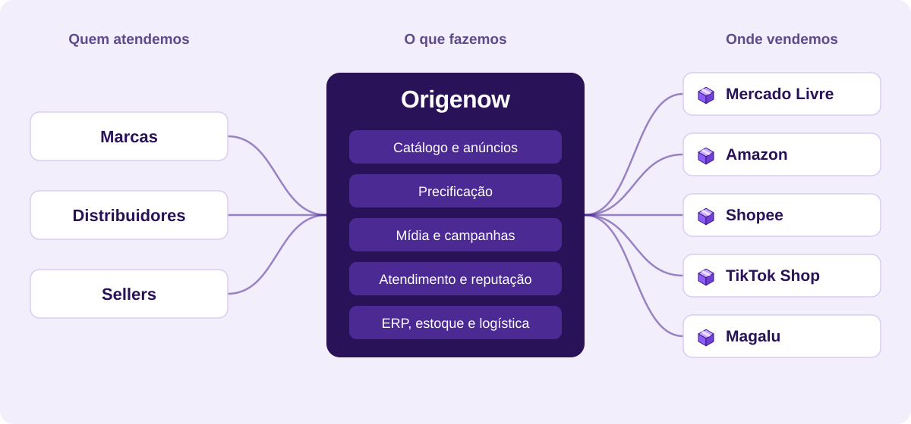
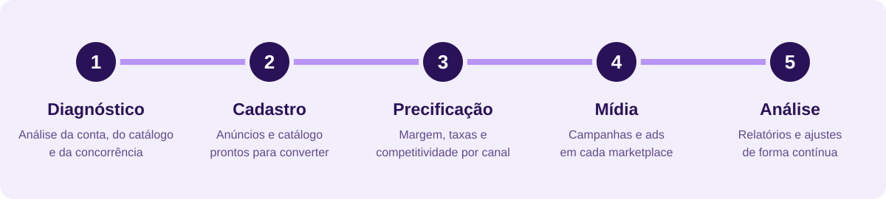
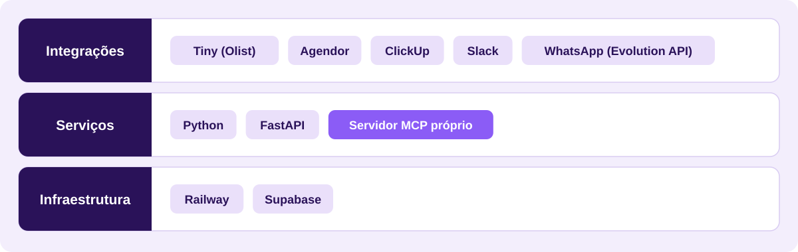

  

  <a href="#o-que-fazemos">O que fazemos</a> |
  <a href="#onde-atuamos">Onde atuamos</a> |
  <a href="#como-trabalhamos">Como trabalhamos</a> |
  <a href="#tecnologia">Tecnologia</a> |
  <a href="#fale-com-a-gente">Fale com a gente</a>

A Origenow é uma agência de e-commerce brasileira, com sede em Manhuaçu (MG), que ajuda marcas e sellers a vender mais nos principais marketplaces do país.

Somos parceiros oficiais do Mercado Livre, Amazon, Shopee, TikTok Shop e Magalu.

## O que fazemos

Cuidamos da operação de e-commerce de ponta a ponta, do cadastro de produtos até a análise de resultados.

| Frente | O que entregamos |
| --- | --- |
| Marketplaces e catálogo | Gestão de contas, cadastro e otimização de anúncios, estratégia de mix e catálogo |
| Preço e performance | Precificação por canal, BuyBox, reputação e relatórios de resultado |
| Mídia paga | Meta Ads, Amazon Ads e Mercado Livre Ads |
| Operação | Full service para marcas e distribuidores, integração de ERP, estoque e logística |
| Consultoria | Mentoria para sellers |
| Automação | Integrações e agentes de IA para ganhar escala na operação |

## Onde atuamos

  

Ver o detalhe por canal

| Canal | Frente de trabalho |
| --- | --- |
| Mercado Livre | Anúncios, catálogo, Product Ads, atendimento e reputação |
| Amazon | Seller (3P) e Vendor (1P), listagem, BuyBox e Amazon Ads |
| Shopee | Cadastro, campanhas e gestão de conta |
| TikTok Shop | Entrada na plataforma e operação da loja |
| Magalu | Integração e gestão de catálogo |

## Como trabalhamos

  

## Tecnologia

Construímos as nossas próprias ferramentas para ganhar escala na operação.

  

## Fale com a gente

Quer entender como a Origenow pode ajudar a sua operação? Fale com um especialista.

- Site: [origenow.com.br](https://origenow.com.br)
- E-mail: [contato@origenow.com.br](mailto:contato@origenow.com.br)

## Licença

Salvo indicação em contrário no repositório, os projetos desta organização seguem a licença descrita no arquivo `LICENSE` de cada um.